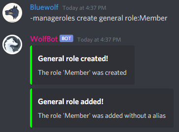
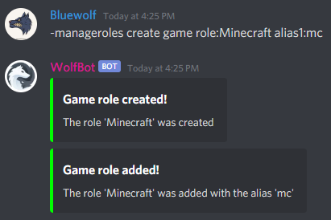
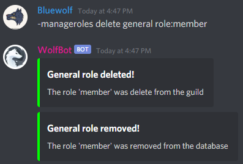
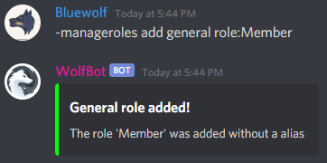
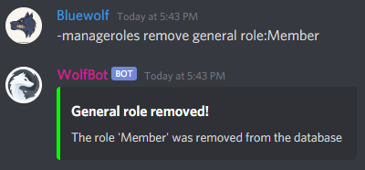
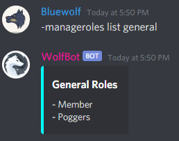
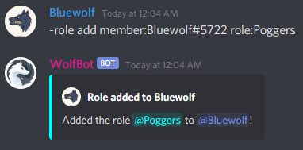
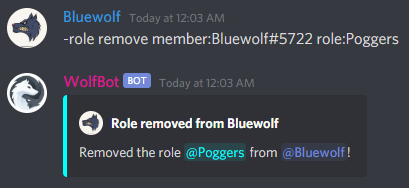
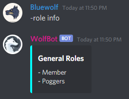

# WolfBot

# Table of Contents
1. [Preface](#preface)
2. [Add WolfBot to your Discord server](#add-wolfbot-to-your-discord-server)
3. [Features](#features)
    1. [Commands](#commands)
        1. [Administration](#administration)
        2. [Moderation](#moderation)
        3. [Management](#management)
        4. [chat](#chat)

## Preface
WolfBot is a JDA Discord Bot. It's on of my first bigger projects I've ever coded and "finished" (I will still work on it).
Don't be too serious, I know not everything makes much sense, and the code is not the best can be optimized in many points,
but the solutions I found and used were the best working for me. I learned and had fun a lot and added some features only for learning 
purpose.

---

## Add WolfBot to your Discord server
[[Click here]](https://discord.com/api/oauth2/authorize?client_id=346302891998576650&permissions=335113463&scope=bot)

Visit also the WolfBot webpage [here]() [COMING SOON]

# Features

## Commands

Command prefix: `-`

* ### Administration

    * #### *setpermission*

* ### Moderation
  
    * #### *clear*
      
    * #### *kick*

    * #### *ban*
  
    * #### *unban*

* ### Management

    * #### *manageroles*
  
        **What permissions you need for this command:**
      
        By default, this command can be performed by guild members with the permission _Manage Roles_.
        This can be change on the [webpage]() or with the command `setpermission`.

        > ##### Note:
        > The Bot is connected to an SQL database where roles will be saved. There are two types of roles a general role (`general`) and a game role (`game`), which can be used for example on gaming community servers. 

        **What you can do with this command:**
        - Create or delete a role on the guild, which will also be added to the database or removed
        - Simple add or remove an existing role from the server to the database
        - List all roles from a specific type (`general`/`game`)
        
            > When creating or adding a role you can define optional two aliases for the role
        
        **Examples:**
        
        - Create a new role: `manageroles create type role:name alias1:alias alias2:alias`
            
            General role | Game role
            ------------ | ---------
             | 
        
        - Delete a role: `manageroles delete type role:name`
    
            General role | Game role
            ------------ | ---------
             | 

        - Add a role: `manageroles add type role:name alias1:alias alias2:alias`
    
            General role | Game role
            ------------ | ---------
             | 

        - remove a role: `manageroles remove type role:name`
    
            General role | Game role
            ------------- | ----------
             | 

        - list all roles: `manageroles list type`

            General roles | Game roles
            ------------ | ---------
             | 

    * #### *role*

        By default, this command can be performed by guild members with the permission _Manage Roles_.
        This can be change on the [webpage]() or with the command `setpermission`.

         

        - Add a general role to a guild member
        - Remove a general role from a guild member
        - List all general roles
    
        **Examples:**
    
        Add a role to a guild member | Remove a role from a guild member
        ---------------------------- | ---------------------------------
        `role add userTag role` | `role remove userTag role`
         | 
        
        - List roles: `role info`
        
            

* ### Chat

    * #### *help*
    
    * #### *music*
      
    * #### *vote*
        
    * #### *game*
    
---

